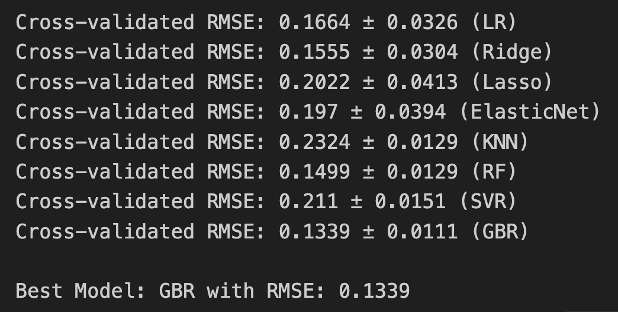
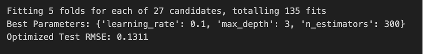

# House Price Prediction using Regression
## Introduction
The goal of this project is to develop various regression models for forecasting house sale prices. This project is based on a general analysis with the Ames Housing dataset consisting of 79 explanatory variables that describe almost every relevant aspect of residential homes in Ames, Iowa. With the power of this rich dataset, we can explore various features that might influence house price building and predictive models.

The dataset is divided into a training set of 1460 samples and a test set of 1459 samples. The target variable is the sale price of the house, which we will try to predict using the given features.
For evaluation, the main metric used is the Root Mean Squared Error. RMSE will give a measure of an average deviation of our forecasts from actual sale prices, the smaller its value, the better the performance of our models.

## Methodology
### Data Preprocessing
Our preprocessing pipeline includes several key steps:
1. Splitting of categorical and numerical features based on the number of unique values.
2. Handling missing values:
    - For 'LotFrontage', we use linear interpolation.
    - For other features with few missing values, we fill with the most frequent value.
    - For features with many missing values, we use LabelEncoder.
3. Encoding categorical variables by one-hot encoding.
4. Log transformation of the target variable to normalize its distribution.
5. Split the data into train and test sets for model evaluation.
### Model Architecture
After initial experimentation with various models, we found that Gradient Boosting Regressor is the best performer. For our final model, it is an optimized version of GBR using the following hyperparameters:
- Number of estimators: 300
- Learning rate: 0.1
- Maximum depth: 3
### Training and Testing Strategy
To ensure proper model evaluation, we took a 5-fold cross validation approach. For the model selection and hyperparameter optimization, we used GridSearchCV, which performs exhaustive search over specified parameter values for an estimator.

## Experimental Results
### Baseline Models
We started off with going through different regression models:
- Linear Regression (LR): RMSE 0.1664 ± 0.0326
- Ridge Regression: 0.1555 ± 0.0304
- Lasso Regression: 0.2022 ± 0.0413
- ElasticNet: RMSE 0.1970 ± 0.0394
- K-Nearest Neighbors: The RMSE: 0.2324 ± 0.0129
- Random Forest (RF): RMSE 0.1496 ± 0.0124
- Support Vector Regression (SVR): RMSE 0.2110 ± 0.0151
- Gradient Boosting Regressor (GBR): RMSE 0.1343 ± 0.0120

Among these, **GBR** had the best performance with the lowest RMSE.

### Checkpoint 2 Model
Considerations from the results obtained with baseline models led us to refine the performance of the Gradient Boosting Regressor. We run hyperparameter tuning using GridSearchCV on the following hyperparameter space:
- n_estimators: [100, 200, 300]
- learning_rate: [0.05, 0.1, 0.2]
- maximum_depth: [3 4 5]

The optimally identified parameters were:
- n_estimators: 300
- learning_rate: 0.1
- maximum_depth: 3

Using those optimum parameters, the improved RMSE could be 0.1311 for the test set.

## Final Model Analysis
The Gradient Boosting Regressor does a better job because it iteratively adds to the weak learners, fixing the mistakes of its predecessors, thus forming a strong learner. In this regard, this methodology seems to do quite well on complex datasets with lots of features, much like our housing price dataset.

The **best GBR model strongly outperformed the baseline GBR model with RMSE scores of 0.1311** for optimized versus **0.1343 for baseline**, again showing that tuning of the hyperparameters matters. The chosen parameters balance model complexity and generalization ability:
- Increased number of estimators, 300, may give a more complex pattern for the model.
- A moderate learning rate, such as 0.1, does not allow for too much overfitting while allowing the model to learn effectively.
- Not-too-large max_depth of 3, avoid the over-fitting to the train data.

## Discussion and Conclusion
This project, especially through the performance of ensemble methods, particularly Gradient Boosting, demonstrates finer performance within house price prediction. Success in the performance of our model comes from:
- Data preparation on a large scale: careful handling of missing values, encoding categorical variables appropriately.
- Systematic evaluation of multiple regression algorithms.
- The cross-validation will also make sure that the models are performing well.
- Hyperparameter tuning for better model performance.

Therefore, with the optimally tuned parameters, the Gradient Boosting Regressor will serve as one of the better foundational models on which one could predict the house prices, giving an `RMSE value of 0.1311`. In fact, this model represents an ideal balance between complexity and generalization; thus, the proposed model would perform well enough in a real-life application within the real estate market.